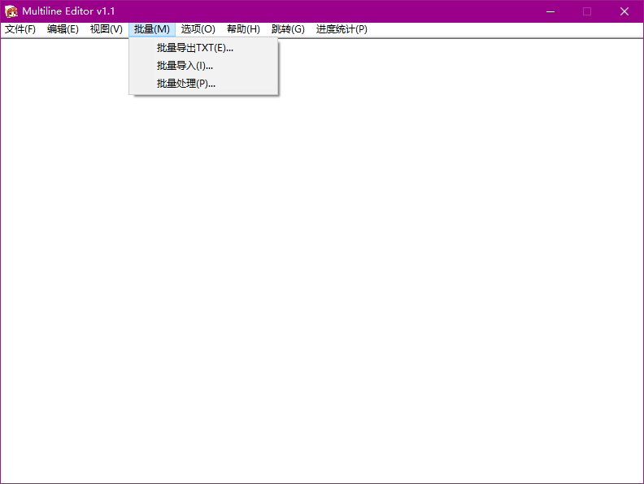

crass 解包scr.xfl得到gsc剧本

<https://github.com/regomne/chinesize/tree/605bc6b6fbe1347c8a1807ccc998f3aa1ddf9fc5/N2System/sg/lneditor> 

最新的 lnedit.exe 

批量导出文本得到的是utf-16编码

---

批量最好。然而我一开始找到的是汇编半成品lnedit.exe ，我还对代码进行了修改……

---

exe破解小记：

很简单，在CreateFontA下断点，然后把CHARSET从x80改成x86即可