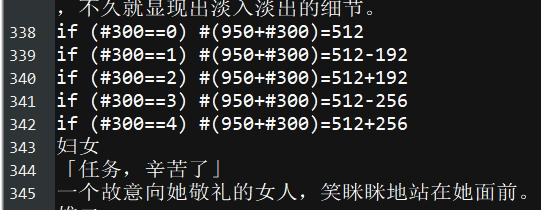
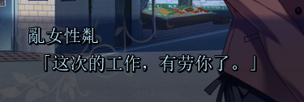
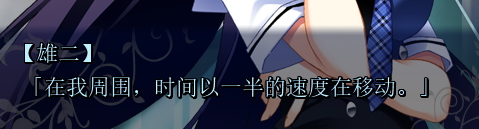

引擎为CatSystem2

解包

<https://www.reddit.com/r/grisaia/wiki/ripping> 

exkifint_v3.exe scene.int Grisaia.exe

当然你也可以用GARbro 

---

解剧本

方法介绍：由于[原博文](<https://shinyashimokawa.space/index.php/archives/373/> )已经无法访问，可以访问我的网页剪切如下：

<https://ultrapre.github.io/clip/%E5%88%9D%E7%AA%A5Galgame%E6%B1%89%E5%8C%96/2019-10-01-1569942419/index.html> 

运行outstring.bat即可。

---

封包过程要先把每一个文本最后一行最后的\n去掉，然后exe破解和上面的链接一样。我整出来的cs3.exe

---

把update等包做个移出备份。

看来问题不在剧本和exe，而是其他文件。

----

如果要打包*.int，那简单，到[CatSystem2](<http://cs2.suki.jp/> )下载http://cs2.suki.jp/data/cs2_full_v301.zip

执行RunMakeInt.bat

---